<div align="center">

<!-- ANIMATED BANNER — upload banner.svg to your repo root and update the path below -->


<br/>

<!-- Animated typing -->
[](https://git.io/typing-svg)

<br/>

<!-- Social badges -->
<a href="https://linkedin.com/in/qolby-yostra-evant-adha">
  
</a>
<a href="mailto:qolbyadha04@gmail.com">
  
</a>
<a href="https://coreboy.my.id">
  
</a>


</div>

<br/>

---

## `$ cat whoami.yaml`

```yaml
name       : "Qolby Yostra Evant Adha"
role       : "Senior Software Engineer"
company    : "Kawan Lama Group"          # Indonesia's largest retail & industrial group
location   : "Jakarta Barat 🇮🇩"
experience : "6+ years"
focus      :
  - Backend Development
  - API Architecture & Microservices
  - DevOps & CI/CD Automation
  - Event-driven Systems (Kafka, RabbitMQ, RedPanda)
currently_learning : ["Golang", ".NET Core 8", "Advanced RoR patterns"]
freelance  : true
contact    : "qolbyadha04@gmail.com"
portfolio  : "https://coreboy.my.id"
```

> Backend engineer with 6+ years building production-grade, high-availability systems — from **CRM platforms that replaced SAP**, to **real-time POS microservices**, to **government ministry websites** serving millions of citizens. I care about systems that stay up when it matters.

---

## 🏢 Work History


**🟣 Kawan Lama Group** &nbsp;`Nov 2022 – Present`  
*Senior Software Engineer*  
Architect & develop CRM, POS, eCommerce APIs as microservices. CI/CD via GitHub Actions & Jenkins. Container orchestration with Docker + Kubernetes. Event streaming with Kafka, RabbitMQ, RedPanda.

**🟣 PT. Ako Media Asia (Salt Indonesia)** &nbsp;`Feb 2022 – Nov 2022`  
*Backend Developer*  
.NET Core, Laravel, Node.js, Pimcore CMS. Docker & VPS deployments. Midtrans payment integration.

**🟣 PT. Bisnis Integrasi Global** &nbsp;`Jul 2020 – Feb 2022`  
*Specialist Web Developer*  
Legacy ERP/logistics modernization. Laravel & ASP.NET MVC migrations. Query optimization.

**🟣 Freelance** &nbsp;`2020 – Present`  
*Backend Developer*  
Government, retail & logistics sectors. Payment gateways (Midtrans). Full ERP systems.

<br clear="right"/>

---

## 🚀 Selected Projects

<div align="center">

| Project | Description | Stack |
|:--------|:------------|:------|
| 🔗 **Supply Sync Navigator API** | Buying plan, PI/PO & shipment tracking for supply chain | RoR 7 · Kafka · Redis · PostgreSQL |
| 🏪 **Phoenix POS System** | Full revamp of legacy POS into modern microservices | RoR 7 · Couchbase · RedPanda |
| 👥 **CRM API** | Replaced SAP C4 Hana — integrated with SSO, POS, Quotation | .NET Core 6 · RabbitMQ · K8s · ECR |
| 🛒 **KawanLama.com** | Industrial products eCommerce API | .NET Core 6 · Elasticsearch · Algolia |
| 🏛️ **Kemenkeu.go.id** | Ministry of Finance website revamp | .NET Core 6 · Kentico · SQL Server |
| 💳 **Prostasia Back Office** | Payment request system with Midtrans integration | Laravel 9 · .NET Core 6 · Docker |
| 🏭 **Perdana Digital App** | Full ERP for manufacturing: PO, SO, production workflow | Laravel 12 · Filament 3 · PostgreSQL |
| 🧸 **Toys Rental** | Online toy rental platform (Toys Game Indonesia) | .NET Core 6 · RabbitMQ · Docker · ECR |

</div>

---

## 🛠 Tech Stack

<!-- Skill Icons — animated hover effect built-in -->
<div align="center">

### Core Languages & Frameworks
[](https://skillicons.dev)

### Databases
[](https://skillicons.dev)

### DevOps & Infrastructure
[](https://skillicons.dev)

### Cloud & Tools
[](https://skillicons.dev)

</div>

<br/>

<!-- Message Brokers + CMS — no skill icons, use badges -->
<div align="center">


</div>

---

## 📊 GitHub Stats

<div align="center">


</div>

<div align="center">

</div>

<div align="center">

</div>

---

<div align="center">


📍 **Jakarta Barat, Indonesia** &nbsp;|&nbsp; 🕐 **WIB (UTC+7)** &nbsp;|&nbsp; 💼 **[coreboy.my.id](https://coreboy.my.id)**

</div>
